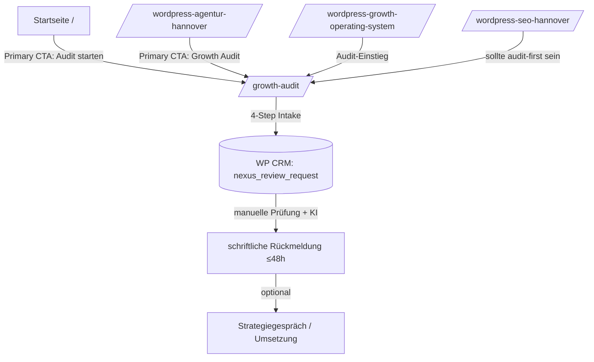
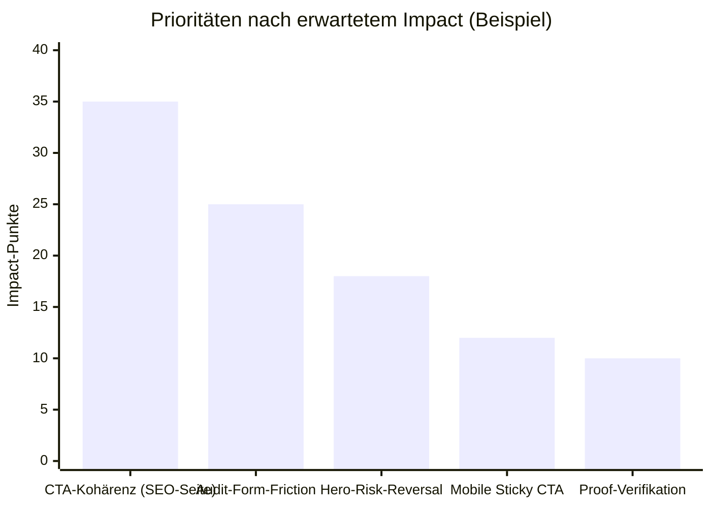

# CRO Deep Research Audit für hasimuener.de mit fünf Schlüssel-Seiten

## Executive Summary

Die Website von Haşim Üner (German Growth Architect) ist klar als B2B-Lead-System positioniert: Primärer Funnel ist **Growth Audit** → Diagnose → Priorisierung → (optional) Gespräch/Umsetzung. Das ist auf der Startseite, der lokalen Agentur-Seite und der WGOS-Systemseite bereits konsistent sichtbar (wiederkehrende Audit-CTAs + Proof + Systemlogik).

Der größte CRO-Hebel liegt nicht in „mehr Design", sondern in **Funnel-Kohärenz**: Eine (der fünf) Top-Seiten — **/wordpress-seo-hannover/** — wirkt aktuell wie ein älterer/abweichender Offer-Stack (Blog-/Insights-Layout, „Kostenloses SEO-Audit", Kalender-CTAs), während der Rest des Systems „Growth Audit zuerst" kommuniziert. Das erzeugt Leckage und unnötige Entscheidungsarbeit beim Nutzer.

Kurzfristig (1–3 Tage) lohnt sich: **(a)** CTA- und Offer-Alignment auf /wordpress-seo-hannover/, **(b)** Audit-Form-Friction & HTML-Bugs im Audit-Shell fixen, **(c)** „0€ / 48h / kein Pflicht-Call"-Mikrocopy konsequent oberhalb der Falz auf allen Entry-Seiten. Mittelfristig (1–2 Wochen): Service-Landings als versionierte Cluster-Pages aus dem Repo ausspielen und Tracking/Artefakte standardisieren, um echte Experimente zu fahren.

## Methodik und Datenbasis

Die Auswahl der fünf wichtigsten Seiten basiert auf zwei Ebenen:

Erstens: **Repo-interne Strukturheuristik**. Im GitHub-Repo (Repo „Hasim-hannover/meine-wordpress-site") liegt ein Seiteninventar mit Tier/Score, das Tier-1-Seiten als „Business-kritisch" klassifiziert. Da ich keinen Zugriff auf Analytics/Conversions habe (auch keine GA4/Server-Logs im Repo als Export gefunden), nutze ich Tier-1 + Funnel-Rolle als primäre Priorisierung.

Zweitens: **Live-Verifikation auf hasimuener.de** (Stand: 15.03.2026, Europe/Berlin). Ich habe die fünf Seiten inhaltlich geprüft (Hero, CTAs, Proof, Preis-/Einwandlogik, Offramps wie Kalender, Footer-CTA). Diese Live-Ebene ist wichtig, weil einzelne Seiten sichtbar „anders" wirken als das repo-seitig intendierte System.

Leit-Heuristiken zur „Wichtigkeit" ohne Traffic-Daten:
- **Entry-Wahrscheinlichkeit** (Startseite, lokale Money-Page, SEO-Service-Landing).
- **Conversion-Nähe** (Growth Audit als primäre Lead-Conversion).
- **Offer-Entscheidung** (WGOS als „System-/Pricing-/Commitment"-Seite).
- **System-Kohärenz** (wie sauber CTAs/Proof/Next Steps in denselben Funnel führen).

## Die fünf wichtigsten Seiten

| Seite (Path) | Repo-Template | Vermutete Zielgruppe/Zweck | Begründung (warum Top-5) |
|---|---|---|---|
| `/` | `blocksy-child/front-page.php` | „Erstkontakt" für B2B-Entscheider, klares Versprechen, Proof, Audit-Einstieg | Höchste Entry-Wahrscheinlichkeit + erster Funnel-Knoten („Audit starten") |
| `/wordpress-agentur-hannover/` | `blocksy-child/page-wordpress-agentur.php` → `page-wordpress-agentur.php` | High-Intent lokale Suchanfragen rund um Hannover, B2B-Wachstum via WordPress | Sehr kaufnah, viel Proof, starke Audit-Führung → großer Conversion-Hebel |
| `/wordpress-growth-operating-system/` | `blocksy-child/page-wgos.php` | „Erst verstehen, dann committen": Systemlogik + Pakete + Audit-Einstieg | Entscheidungsebene (Strategie/Invest), beeinflusst Lead-Qualität und Close-Rate |
| `/growth-audit/` | `blocksy-child/page-audit.php` + `template-parts/audit-page-shell.php` + Funnel-JS | Conversion: Lead-Intake für konkrete Seite, Fokus, Kontext, Kontakt | Zentraler Funnel: 0€ Einstieg + 48h Rückmeldung, keine Pflicht-Calls |
| `/wordpress-seo-hannover/` | `blocksy-child/page-seo.php` + `inc/wgos-cluster-pages.php` | High-Intent SEO-Service-Entry | Wichtig, weil likely organischer Entry-Point → aktuell aber systemisch inkonsistent → Leckage/Verwirrung |

## CRO Audit pro Seite

### Startseite `/`

**Rolle im Funnel:** Erstkontakt → Proof/Verständnis → **Audit starten**. Die Seite kommuniziert klar „planbares Anfragesystem", setzt Audit als primäre Aktion und zeigt früh Proof + öffentliche Nachvollziehbarkeit.

**Probleme und Priorität**
- **Mikrocopy am primären CTA kann noch stärker „Risiko senken"**: Auf der Startseite ist „Audit starten" klar, aber die harten Conversion-Trigger („0€", „48h", „kein Pflicht-Call") stehen nicht als kompakte CTA-Nähe direkt neben dem Button, obwohl sie auf der Audit-Seite stark wirken. Priorität: **hoch** (weil CTA-Klick-Rate häufig hero-getrieben).
- **Proof-Zahlen ohne unmittelbare „Verifikations-Brücke"**: Proof ist stark (Case, Public Proof), aber Nutzer mit Skepsis profitieren von einem sichtbaren *„Wie verifizieren?"*-Pfad (z.B. „Case lesen" direkt neben jeder Zahl oder Tooltip „Quelle: Case Study"). Priorität: **mittel**.
- **„Knowledge Base"-Teaser kann als Offramp wirken, wenn er zu „laut" wird**: Aktuell ist er bewusst ruhig. Das ist gut → aber messen, ob er trotzdem Audit-Klicks wegzieht. Priorität: **niedrig**, aber tracken.

**Quick Wins**
- Direkt unter dem Hero-CTA eine kompakte „Risk Reversal"-Zeile: **„0€ • 48h • kein Pflicht-Call"** (Desktop + Mobile).
- Proof-Kacheln: neben „Case Study lesen" zusätzlich „Was genau wurde gemacht?" als kurzer Anker in den Case (reduziert Skepsis).

**Strukturelle Maßnahmen**
- CTA-Hierarchie als „Design System" behandeln: ein wiederverwendbares CTA-Pattern (Button + Microcopy + Secondary Link) für alle Tier-1 Seiten, statt pro Template neu zu erfinden.

**A/B-Test-Hypothesen**
- H1/Hero-Boost: *Wenn* die Hero-CTA-Nähe einen Risk-Reversal-Strip erhält („0€ / 48h / kein Pflicht-Call"), *dann* steigt die CTR auf „Audit starten", weil Unsicherheit vor dem Klick sinkt.
- Secondary CTA: *Wenn* „Ergebnisse ansehen" als sekundärer Button statt Textlink erscheint, *dann* steigt Proof-Konsum, aber möglicherweise sinkt Audit-CTR → Test nötig.

**Impact / Aufwand**
- Erwarteter Impact: **hoch** (Hero-CTR wirkt als Funnel-Multiplikator)
- Aufwand: **S** (Template-Anpassung + CSS)

---

### `/wordpress-agentur-hannover/`

**Rolle im Funnel:** High-Intent lokale Money-Page → Proof → Audit. Die Seite macht „Audit zuerst" sehr explizit („Erst ein Growth Audit. Danach erst die Entscheidung…") und enthält früh Proof-Kennzahlen.

**Probleme und Priorität**
- **Absatz-/Lesefluss bei KPI-Zeilen**: Einige KPI-Reihen wirken wie „komprimierter Text", nicht wie scannbare Einheit (kann mobile Skimming bremsen). Priorität: **mittel**.
- **Long-Form-Seite: Mobile-Fatigue**: Die Seite ist lang; ohne klare Sticky-Aktion kann mobile Conversion leiden. Es gibt zwar mehrfach Audit-CTAs, aber ein persistenter mobile CTA kann die „Return-to-top"-Friction eliminieren. Priorität: **hoch**.
- **Vergleichstabelle „Agentur-Logik vs Growth-Architect-Logik" braucht direkt danach eine Entscheidungsschleuse**: Tabelle erklärt, aber *nach* der Erklärung fehlt oft ein „Jetzt sinnvoller Next Step"-Block direkt im Anschluss (statt erst später). Priorität: **mittel**.

**Quick Wins**
- Mobile Sticky CTA-Bar wie auf der Startseite („Audit starten") plus Microcopy.
- Direkt nach Vergleichstabelle: Mini-CTA „Wenn das nach Ihnen klingt → Growth Audit starten".

**Strukturelle Maßnahmen**
- Ein „Intent Split" oberhalb der Falz testen:
  (A) „Audit starten" (primary)
  (B) „Ergebnisse ansehen" (secondary)
  (C) „WGOS verstehen" (tertiary)
  Ziel: verschiedene Reifegrade abholen, ohne Funnel zu verwässern.

**A/B-Test-Hypothesen**
- *Wenn* mobile Sticky CTA aktiv ist, *dann* steigt die Audit-CTR und sinkt die Scrolltiefe bis zum nächsten CTA (weniger Reibung).
- *Wenn* der lokale Benefit („Workshops/Reviews in Hannover") als Trust-Signal in eine kompakte Badge-Leiste im Hero gezogen wird, *dann* steigt Relevanzgefühl für lokale Besucher.

**Impact / Aufwand**
- Erwarteter Impact: **hoch** (Money-Page + High-Intent)
- Aufwand: **M** (Template + CSS + saubere Breakpoints + Tracking)

---

### `/wordpress-growth-operating-system/`

**Rolle im Funnel:** „System verstehen" + Investitionsrahmen → Audit. Die Seite positioniert klar, dass der Growth Audit der operative Einstieg ist und bietet Audit-CTA im Audit-Block plus am Schluss.

**Probleme und Priorität**
- **Hero-CTA ist aktuell nur „WGOS in 60 Sekunden verstehen" (Anchor)**: Für High-Intent Besucher ist das ein Extra-Schritt; Audit-CTA erscheint später. Priorität: **hoch** (WGOS ist Decision-Page).
- **Pricing-Abschnitt: Preisanker ohne „Audit-first"-Guardrail direkt am Einstieg**: Im Text wird „Audit zuerst" erklärt, aber ein „Audit-first"-Hinweis direkt im Pricing-Header reduziert Preis-Schock und fördert den passenden Next Step. Priorität: **mittel**.
- **Zwei Eskalationspfade: Audit vs Strategiegespräch**: Das ist okay, aber es braucht klare Logik: „Audit zuerst" sollte visuell/semantisch dominieren; Call ist Eskalation, nicht Alternative. Priorität: **mittel**.

**Quick Wins**
- Im Hero zwei Aktionen (Primary: **„Growth Audit starten (0€)"**, Secondary: „WGOS in 60 Sekunden verstehen").
- Pricing-Header: eine Zeile „Pakete werden erst nach Audit sinnvoll gewählt. Vorher wäre es Spekulation." (die Aussage existiert bereits, nur prominenter machen).

**Strukturelle Maßnahmen**
- „Proof → Audit"-Übergang früher: Nach dem ersten Proof-Strip im Hero eine kurze „Warum Audit zuerst"-Box (max. 3 Sätze). Das verkürzt die Zeit bis zur Conversion, ohne WGOS zu entwerten.
- „Calendar" konsequent als *Eskalationspfad* labeln (z.B. „Wenn Sie schon sicher sind, dass…"), sonst wirkt es wie Alternative.

**A/B-Test-Hypothesen**
- *Wenn* Audit-CTA im Hero ergänzt wird, *dann* steigt Audit-CTR auf dieser Seite, weil ein Teil der Besucher bereits „decision-ready" ist.
- *Wenn* der Pricing-Abschnitt erst nach einem „Fit"-Block kommt, *dann* sinkt Absprungrate (weniger Preis-Schock bei nicht passenden Besuchern).

**Impact / Aufwand**
- Erwarteter Impact: **mittel–hoch** (Qualität/Close-Rate, nicht nur Leadmenge)
- Aufwand: **S–M** (Template + Copy + ggf. CSS)

---

### `/growth-audit/`

**Rolle im Funnel:** Primäre Conversion (Lead-Intake). Die Seite verspricht 0€ Einstieg, manuelle + KI-unterstützte Prüfung und Rückmeldung in 48 Stunden; kein Pflicht-Call. Das Formular ist 4-stufig (Seite → Priorität → Kontext → Kontakt).

**Probleme und Priorität**
- **HTML-Attribut-Bug (Smart Quotes) im Audit-Shell**: Im Template existieren Attribute mit typografischen Anführungszeichen (z.B. `id="lead-loss"`). Das kann DOM-Selektoren, CSS/JS und Accessibility brechen. Priorität: **hoch**.
- **Form-Friction: „zu viel Freitext" ohne Beispiel**: „Kurzbeschreibung" ist gut, aber Nutzer liefern oft zu wenig Kontext. Ein Mini-Beispiel („1–2 Sätze, z.B. …") erhöht Diagnosequalität und reduziert Back-and-forth. Priorität: **hoch** (Lead-Qualität).
- **Consent ist systemkritisch**: Repo-seitig ist ein explizites Privacy-Consent-Feld vorgesehen (Checkbox), und serverseitig wird „accepted" validiert. Das ist gut → muss aber visuell klar, vertrauensstiftend und barrierearm sein. Priorität: **hoch**.
- **Instrumentierung ist vorhanden, aber muss operationalisiert werden**: Der Funnel feuert DataLayer-Events (Step Views, Validation Errors, Abandon). Ohne sauberes GTM/GA4 Mapping bleibt das Potenzial ungenutzt. Priorität: **mittel–hoch**.

**Quick Wins**
- Smart Quotes fixen (siehe Umsetzung).
- In Schritt 3 („Kurzbeschreibung") placeholder + Beispieltext.
- Direkt im Hero (unter CTA) eine „Was ich brauche / was nicht" Mini-Liste (reduziert Angst, zu viel liefern zu müssen).

**Strukturelle Maßnahmen**
- **Lead-Qualität statt nur Completion**: Optional-Feld „Deadline/Kampagne" als strukturiertes Feld (Dropdown: „keine / <2 Wochen / <1 Monat / >1 Monat") → hilft Priorisierung ohne langen Text.
- **CRM-feedback loop**: Da Requests als Custom Post Type gespeichert werden, lohnt sich ein interner „Quality Score" (1–5), um später zu sehen, welche Formulierungen/Quellen bessere Leads liefern.

**A/B-Test-Hypothesen**
- *Wenn* Schritt 1 einen „URL + Ziel in 1 Satz"-Prompt erhält, *dann* sinkt Abbruchrate in Schritt 2–3, weil Nutzer gedanklich früher committed sind.
- *Wenn* CTA von „Kostenlosen Growth Audit anfragen" zu „0€ Audit starten → Rückmeldung in 48h" geändert wird, *dann* steigt Start-Rate, weil Nutzen/Timing sofort sichtbar ist.

**Impact / Aufwand**
- Erwarteter Impact: **sehr hoch** (Primär-Conversion)
- Aufwand: **S** (Template + Copy + kleine JS/HTML Verbesserungen)

---

### `/wordpress-seo-hannover/`

**Rolle im Funnel:** High-Intent SEO-Service Entry. Live wirkt die Seite wie ein „Insights/Blog-Post" (Datum, Blog Navigation), mit CTAs wie „Kostenloses SEO-Audit starten" und zusätzlichen kalendergetriebenen Angeboten („Tech-Reset buchen", „Partnerschaft anfragen" via Cal.com).

**Kernproblem (hoch): Offer- und CTA-Inkonsistenz**
- Der Rest des Systems führt sauber in den **Growth Audit** als Einstieg (Startseite, Agentur, WGOS, Footer).
- Diese Seite führt dagegen in ein anderes Narrativ („Kostenloses SEO-Audit", „Jetzt Website scannen", Kalenderbuchung) und zeigt teils „0"-Werte als Platzhalter-KPIs (wirkt wie unfertiger Proof). Das ist ein klassischer Conversion-Killer: Nutzer sind gezwungen, zuerst zu klären „welches Angebot ist jetzt eigentlich der Einstieg?".

**Quick Wins**
- Above-the-fold CTA ersetzen: **Primary = Growth Audit** (0€ / 48h / keine Pflicht), Secondary = „WGOS verstehen" oder „Case Study ansehen".
- Platzhalter-KPIs entfernen oder mit echten, verifizierbaren Proof-Snippets ersetzen (oder bewusst weglassen).
- Blog-/Insights-Chroming reduzieren (wenn es eine Service-Landing sein soll): Ziel ist „Service-Seite", nicht „Artikel".

**Strukturelle Maßnahmen**
- Repo-seitig existiert bereits eine **versionierte SEO Landing** (`page-seo.php`) und ein Cluster-Page-System (`inc/wgos-cluster-pages.php`), das genau dafür gedacht ist: konsistente Service-Seiten aus dem Repo (statt Editor/Blog-Mix). Das sollte die Source of Truth werden.
- Entscheiden (strategisch):
  - **Variante A (empfohlen):** SEO-Seite ist ein Einstieg in **denselben** Funnel → Audit zuerst.
  - **Variante B:** SEO-Seite verkauft ein eigenes SEO-Produkt → dann muss das überall konsistent sein (Startseite/WGOS/Agentur dürfen nicht audit-first sein).
  Da der Rest der Site bereits audit-first ist, ist A in der Praxis fast immer die höhere CRO-Option.

**A/B-Test-Hypothesen**
- *Wenn* /wordpress-seo-hannover/ von „SEO-Audit/Tech-Reset/Retainer" auf „Audit-first" umgestellt wird, *dann* steigt die qualifizierte Lead-Rate (weniger Kalender-Friktion, weniger Angebotsverwirrung).
- *Wenn* „Preisblöcke" erst nach einem Fit-/Proof-Block kommen, *dann* sinkt Bounce Rate und steigt Scroll-Depth bis CTA.

**Impact / Aufwand**
- Erwarteter Impact: **hoch** (High-Intent Service Entry + mögliche SEO-Traffic-Quelle)
- Aufwand: **M–L** (Template-/Content-Replatforming, interne Links, CTA-System, ggf. Redirect-/Canonical-Checks)

## Umsetzung mit konkreten Änderungen und Agenten-Tickets

### Repo-nahe Quick Fixes

**Ticket A: Smart Quotes im Audit-Shell entfernen (Bugfix + Stabilität)**
Problem: `id="..."` etc. (typografische Quotes) im Audit-Shell.
Datei: `blocksy-child/template-parts/audit-page-shell.php`

Beispiel-Fix (Pattern, kein vollständiger Diff):
```php
<!-- vorher (bad) -->
<section id="lead-loss" class="review-section">

<!-- nachher (good) -->
<section id="lead-loss" class="review-section">
```

**Ticket B: Risk-Reversal Microcopy unter primären CTAs (Homepage + Agentur + WGOS)**
Ziel: überall sofort klar: 0€ Einstieg, 48h Rückmeldung, kein Pflicht-Call. (Audit-Seite kommuniziert das bereits sehr stark.)
Dateien:
- `blocksy-child/front-page.php`
- `blocksy-child/page-wordpress-agentur.php`
- `blocksy-child/page-wgos.php`

Snippet-Idee (HTML):
```html
<p class="nx-cta-microcopy">0 € • Rückmeldung in 48h • kein Pflicht‑Call</p>
```

**Ticket C: WGOS-Hero um sekundären Audit-CTA ergänzen (High-Intent Abkürzung)**
Live: WGOS-Hero startet mit „WGOS in 60 Sekunden verstehen"; Audit-CTA kommt später.
Datei: `blocksy-child/page-wgos.php`

```php
<div class="wgos-hero__actions">
  <a href="<?php echo esc_url($audit_url); ?>" class="wgos-btn wgos-btn--primary">Growth Audit starten (0€)</a>
  <a href="#system" class="wgos-btn wgos-btn--ghost">WGOS in 60 Sekunden verstehen</a>
</div>
```

### Funnel-Instrumentierung und Artefakte

**Ticket D: Analytics-Mapping für Audit-Funnel Events (GTM/GA4)**
Der Funnel feuert bereits DataLayer-Events (u.a. Step Views, Navigation, Validation Errors, Abandon, Submit Started/Success/Failed).
Artefakte zu sammeln:
- Liste aller DataLayer Events + Parameter (Screenshot/Export aus DevTools „dataLayer").
- GA4 DebugView Screenshots (Event-Namen + Parameter).
- Funnel-Report: Step-View → Next → Submit Success (Baseline).

**Ticket E: SEO-Service-Seite auf versionierte Landing umstellen (Offer-Alignment)**
Ziel: /wordpress-seo-hannover/ wird audit-first und nutzt repo-seitige Landing-Struktur (statt Blog-/Offer-Mix). Live zeigt aktuell abweichende CTAs inkl. Kalenderbuchung.
Repo-Bausteine:
- `blocksy-child/page-seo.php` (Template Name: SEO Landing)
- `blocksy-child/inc/wgos-cluster-pages.php` (Cluster Page System)

Umsetzungsoption (WordPress Admin, minimal-invasiv):
- Seite /wordpress-seo-hannover/ im WP-Backend öffnen → Template „SEO Landing" auswählen → Inhalte/CTAs aus Template statt Editor/Bloqlayer verwenden.
Umsetzungsoption (Code, maximal robust):
- Falls Template-Zuweisung nicht greift: eigene `page-wordpress-seo-hannover.php` erstellen, die `page-wgos-pillar.php` lädt und den SEO-Cluster rendert.

## Funnel-Visualisierung und Prioritäten

### Conversion-Funnel



### Beispiel-Pareto der Hebel



CRO-Logik dahinter: Wenn ein System audit-first ist, gewinnt man oft mehr durch **weniger Verwirrung** und **kürzere Wege zum Audit**, als durch kosmetische Änderungen.
